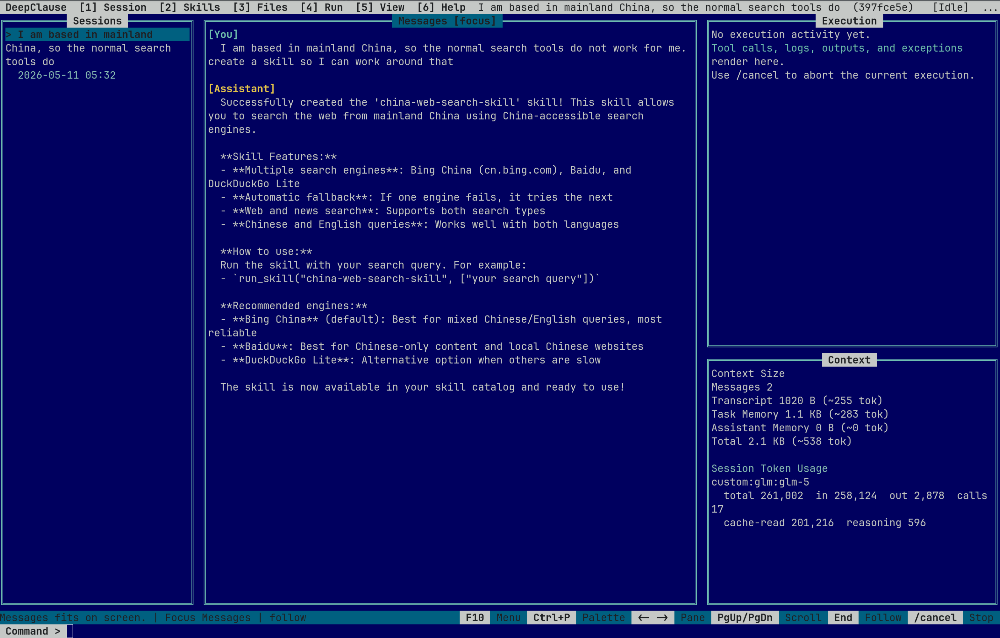

# DeepClause TUI Agent, CLI and SDK

Compile markdown specs into executable logic programs. Guaranteed execution semantics for agentic workflows. Comes with a minimal coding agent incl. a nostalgic Borland-style TUI.





## What This Is

AI skills and tools are everywhere, but most are still just prompts. When a prompt fails, you tweak it. When you need branching logic, you write wrapper code. When you want retry behavior, you build it yourself.

DeepClause takes a different approach: **compile task descriptions into DML programs** - a Prolog-based language that handles control flow, error recovery, and tool orchestration automatically.

The three main ways to use DeepClause are:

1. Coding Agent
    - Specialty: Create executable plans from specs and prompts
2. General Purpose Automation
    - Compile recurring tasks into skills, small logic programs that orchestrate agents, prompts, and deterministic code
3. Testbed for LLM+Prolog
    - Explore how constrained logic, tool calls, and model output interact in a reproducible runtime


## Benchmark: DeepPlanning Travel Planning

DeepClause was evaluated on the [DeepPlanning](https://arxiv.org/abs/2601.18137) travel planning benchmark, which tests long-horizon agentic planning with verifiable constraints (time, budget, geography). The benchmark requires agents to gather information via tool calls, reason about local constraints, and produce globally coherent multi-day itineraries evaluated across 8 commonsense dimensions and personalized hard constraints.

| Agent | Plan Model | Run Model | Composite | Case Acc | Delivery |
|-------|-----------|-----------|-----------|----------|----------|
| Qwen-Agent baseline (paper) | qwen3.6-35b-a3b | qwen3.6-35b-a3b | 22.2% | 0.0% | 82.5% |
| DeepClause DML (direct) | qwen3.6-35b-a3b | qwen3.6-35b-a3b | 36.5% | 0.0% | **98.3%** |
| DeepClause DML (plan-execute) | qwen3.6-plus | qwen3.6-35b-a3b | **42.9%** | 0.0% | 96.7% |

Full comparison with frontier models from the DeepPlanning paper (travel planning only):

| Model | CS | PS | Comp | Case Acc |
|-------|-----|-----|------|----------|
| **Non-Reasoning Models** | | | | |
| Anthropic/Claude-4.5-Opus (w/o thinking) | 67.5 | 58.8 | 63.1 | 6.7 |
| Anthropic/Claude-4.5-Sonnet (w/o thinking) | 53.4 | 42.8 | 48.1 | 1.1 |
| Alibaba/Qwen3-Max (w/o thinking) | 36.7 | 30.7 | 31.8 | 0.8 |
| ByteDance/Seed-1.8-minimal | 43.0 | 47.5 | 45.3 | 0.0 |
| Alibaba/Qwen-Plus (w/o thinking) | 37.3 | 13.0 | 25.1 | 0.0 |
| Z.ai/GLM-4.7 (w/o thinking) | 38.9 | 22.5 | 30.7 | 0.0 |
| DeepSeek-AI/DeepSeek-V3.2 (w/o thinking) | 37.4 | 12.1 | 24.7 | 0.0 |
| OpenAI/GPT-5.2-none | 54.3 | 29.9 | 42.1 | 0.4 |
| xAI/Grok-4.1-Fast (non-reasoning) | 39.6 | 19.7 | 29.6 | 0.0 |
| **Reasoning Models** | | | | |
| OpenAI/GPT-5.2-high | 88.5 | 83.3 | 85.8 | 35.0 |
| Anthropic/Claude-4.5-Opus (w/ thinking) | 79.3 | 70.9 | 75.1 | 22.7 |
| OpenAI/GPT-5-high | 78.7 | 65.9 | 72.3 | 18.9 |
| Google/Gemini-3-Flash-Preview | 67.1 | 57.7 | 62.4 | 5.9 |
| Alibaba/Qwen3-Max (w/ thinking) | 64.0 | 61.7 | 62.8 | 13.8 |
| Anthropic/Claude-4.5-Sonnet (w/ thinking) | 65.2 | 58.4 | 61.8 | 7.6 |
| OpenAI/o3 | 76.5 | 55.6 | 66.1 | 11.3 |
| Google/Gemini-3-Pro-Preview | 58.4 | 25.1 | 41.8 | 0.7 |
| Deepseek-AI/DeepSeek-V3.2 (w/ thinking) | 47.4 | 35.0 | 41.2 | 0.7 |
| ByteDance/Seed-1.8-high | 43.6 | 56.7 | 50.1 | 0.0 |
| xAI/Grok-4.1-Fast (reasoning) | 57.1 | 37.7 | 47.4 | 2.7 |
| Alibaba/Qwen-Plus (w/ thinking) | 35.4 | 22.4 | 28.9 | 0.0 |
| Google/Gemini-2.5-Pro | 62.3 | 42.0 | 52.2 | 3.2 |
| Z.ai/GLM-4.7 (w/ thinking) | 44.0 | 44.6 | 44.3 | 0.4 |
| OpenAI/o4-mini | 58.0 | 36.6 | 47.2 | 3.0 |
| Moonshot-AI/Kimi-K2-Thinking | 45.2 | 32.5 | 38.9 | 0.0 |
| qwen3.6-35b-a3b baseline  | 44.5 | 0.0 | 22.2 | 0.0 |
| **DeepClause** | | | | |
| DeepClause plan-execute (qwen3.6-35b-a3b) | 32.9 | 40.0 | 36.5 | 0.0 |
| DeepClause plan-execute (plan: qwen3.6-plus, run: qwen3.6-35b-a3b) | 34.1 | 51.7 | **42.9** | 0.0 |

CS = Commonsense Score, PS = Personalized Score, Comp = Composite Score. Results from the DeepPlanning paper (Table 2, travel planning only) are averaged over four runs across Chinese and English variants; DeepClause results are on the English subset. The DeepClause plan-execute variant outperforms the Qwen-Agent baseline by +93% on composite score (42.9% vs 22.2%) using the same execution model, and matches or exceeds several frontier reasoning models (DeepSeek-V3.2 w/ thinking: 41.2%, Gemini-3-Pro-Preview: 41.8%) — without any internal reasoning capability.

The plan-execute variant runs in two phases. In the **plan phase**, a stronger model (qwen3.6-plus) analyzes the travel request and generates a self-contained DML file: it derives a system prompt, decomposes the request into 3-6 focused gathering tasks, and assembles DML program that includes all tool definitions and the execution logic. In the **execute phase**, a cheaper model (qwen3.6-35b-a3b) runs the generated DML.

Example for a generated plan:

```
:- use_module(library(http/json)).

% --- Travel Tool Bridge ---

run_tool(ToolName, ArgsDict, Result) :-
    param(db_path, DbPath),
    param(bridge_dir, BridgeDir),
    param(bench_dir, BenchDir),
    param(python_path, PythonPath),
    (var(PythonPath) -> PythonPath = 'python3' ; true),
    atom_json_dict(ArgsJson, ArgsDict, []),
    format(string(ArgsFile), ".dc_bridge_~w.json", [ToolName]),
    exec(write_file(path: ArgsFile, content: ArgsJson), _),
    format(string(Cmd), "~w '~w/python-bridge.py' --domain travel --db-path '~w' --bench-dir '~w' --tool ~w --args-file '~w'", [PythonPath, BridgeDir, DbPath, BenchDir, ToolName, ArgsFile]),
    exec(bash(command: Cmd), Raw),
    parse_bridge_result(Raw, Result).

tool(query_train_info(Origin, Dest, Date, Result),
     "Search for train tickets between two cities on a given date. Returns train number, times, stations, duration, seat class, remaining seats, price.") :-
    run_tool(query_train_info, _{origin: Origin, destination: Dest, depDate: Date}, Result).


[ ... more tool definitions ...]

agent_main(Request) :-
    system("You are a travel planning agent creating a detailed itinerary for 4 travelers from Zhengzhou to Quanzhou (Nov 12-15, 2025). Execute the planned gathering steps autonomously without asking for user input.\n\nRULES:\n- All information must come from tool results — never fabricate names, prices, or details\n- Restaurant names must be EXACT matches from recommend_restaurants/query_restaurant_details results\n- Use recommend_restaurants with attraction/hotel coordinates passed as STRINGS, not restaurant coordinates\n- Current City on intercity travel days must use 'from CityA to CityB' format (literal 'from' and 'to')\n- Budget: all prices are per-unit; multiply by number of travelers/rooms in the final summary\n- Schedule times must be continuous with no gaps; do not schedule breakfast; full days require lunch+dinner\n- Last day (Nov 15) must end at the departure airport/station for the return journey\n- Select the shortest-duration direct outbound flight, a 4-star hotel with free parking, the 3 highest-rated attractions, and the cheapest restaurant in Donghai Bay area\n\nProceed through all gathering steps, then compile the complete itinerary with continuous daily schedules, exact venue names, and accurate budget calculations."),
    user(Request),
    task("Search for direct flights from Zhengzhou to Quanzhou on November 12, 2025, and return flights from Quanzhou to Zhengzhou on November 15, 2025, for 4 passengers, identif
ying the shortest-duration direct flight option for the outbound journey."),
    task("Search for four-star hotels in Quanzhou with free parking available for check-in on November 12, 2025 and check-out on November 15, 2025, accommodating 4 guests."),
    task("Search for and recommend top-rated attractions in Quanzhou, then retrieve details to identify the three highest-rated attractions."),
    task("Search for restaurants in the Donghai Bay area of Quanzhou and find the one with the lowest average spending per person."),
    task('Based on all gathered information, generate the complete travel itinerary inside <plan></plan> tags. Include day-by-day schedule with times, Current City, attractions,
meals with EXACT restaurant names from tool results, transport details, and a budget summary where per-unit costs are multiplied by number of travelers/rooms.', string(DraftPlan)
),
    task('Review this travel plan for errors and fix them. Check ALL of the following:
1. BUDGET: Is total cost (per-person costs * travelers, per-room costs * rooms) within budget?
2. TIME CONTINUITY: Are times continuous with no gaps or overlaps? Each activity end time = next start time.
3. MEAL RULES: Full sightseeing days need lunch AND dinner. No breakfast. Meals 1-2 hours. At least 2 hours between lunch and dinner.
4. DAILY STRUCTURE: Every day except last ends at hotel. Last day ends at departure airport/station.
5. GEOSPATIAL: No teleportation — travel_city between different locations.
6. DIVERSITY: No repeating restaurants or attractions across days.
7. NAMES: All names EXACTLY match tool results — no abbreviations or renames.
8. CURRENT CITY: Intercity days must say "from CityA to CityB".

Plan to review:
{DraftPlan}

If the plan has errors, output the CORRECTED plan inside <plan></plan> tags. If it is already correct, output it unchanged inside <plan></plan> tags. Store the final verified plan in VerifiedPlan.', string(VerifiedPlan)),
    answer(VerifiedPlan).

agent_main(Request) :-
    system('You are a travel planning assistant. Create a travel plan using the available tools. Output inside <plan></plan> tags with budget summary.'),
    user(Request),
    task('Create a complete travel plan using all available tools. Output inside <plan></plan> tags.', string(Plan)),
    answer(Plan).
```


## Install and Run

DeepClause requires Node.js 18+.

### Global install

```bash
npm install -g deepclause-sdk

# Pick one provider and export its API key
export OPENAI_API_KEY="sk-..."
# or: export ANTHROPIC_API_KEY="..."
# or: export GOOGLE_GENERATIVE_AI_API_KEY="..."
# or: export OPENROUTER_API_KEY="..."

# Initialize the current workspace
deepclause init --model openai:gpt-4o

# Inspect the configured slots
deepclause show-model

# Start the fullscreen conductor TUI
deepclause

# Or run one headless conductor turn
deepclause -p "Summarize the repository architecture"
```

### One-off usage with npx

```bash
npx deepclause-sdk@latest init --model openai:gpt-4o
npx deepclause-sdk@latest show-model
npx deepclause-sdk@latest
```

All commands except `init`, `help`, `--help`, `--version`, and `-V` expect a `.deepclause/` directory in the current workspace.

`deepclause init` creates:

- `.deepclause/config.json`
- `.deepclause/tools/`
- `.deepclause/docs/`
- `.deepclause/docs/TUI.md`
- `.deepclause/system/`
- `.deepclause/system/recipes/`
- `.deepclause/.gitignore`
- seeded local skills: `deep-research` and `research-search-reader`
- seeded example recipe: `deepclause-coding-workflow`
- editable system overrides:
    - `conductor.dml`
    - `skill-creator.dml`
    - `CONDUCTOR_PROMPT.md`
    - `DML_COMPILER_PROMPT.md`
    - `TASK_PROMPT.md`

The default recipe is created at `.deepclause/system/recipes/deepclause-coding-workflow/SKILL.md`. It is a real example, not a placeholder: it teaches the conductor how to approach local repository changes with small edits and focused validation. You can edit it, remove it, or add your own recipes next to it.

Recipes are plain markdown guidance, not executable DML. If you want to add or update one, edit `.deepclause/system/recipes/<slug>/SKILL.md` directly. The conductor can search those recipe files on future turns via `consult_recipes`.

## TUI Agent

Running `deepclause` with no subcommand starts the fullscreen TUI.

- Session list on the left
- Messages in the center
- Execution log and context summary on the right
- Slash commands such as `/new`, `/sessions`, `/set-model <model> [--slot <slot>]`, `/compile <spec>`, `/skill-creator <spec>`, `/cancel`, and `/<skill> [args]`
- Direct shell commands with `!<command>`, streamed live in the execution pane and cancelled with `/cancel`
- Persistent shell commands with `!!<command>`, which also append the command and its output to the active session transcript so the conductor can see them on the next turn

Use `!<command>` when you just want an ephemeral shell escape in the execution pane. Use `!!<command>` when the shell result should become part of the conversation state for later conductor turns.

For non-interactive use, `deepclause -p "..."` runs a single headless conductor turn with a fresh session.

### Basic Structure

The TUI is the interface around a single built-in agent: the conductor.

- The TUI itself is just the UI shell: session browser, messages pane, execution log, and context view.
- The conductor is the actual agent that receives your prompt each turn and decides what to do.
- The conductor is implemented as a system DML skill plus a system prompt.
- The conductor can answer directly, call an existing local skill, consult the recipe library for workflow guidance, invoke the skill creator to make a new skill, use shell tools, or do web research.

Conceptually, a TUI turn works like this:

1. Load the current session from `.deepclause/sessions/<session-id>/`.
2. Build the conductor prompt from the resolved conductor prompt template, the current skill catalog, the recipe library, assistant memory, task memory, and session transcript.
3. Run the conductor DML with the `gateway` model slot.
4. Stream the conductor's own activity and any child-skill events into the execution log on the right.
5. Persist the final user/assistant messages, structured `execution-log.jsonl`, and updated usage counters back into the session directory.

The conductor is the router and orchestrator for the CLI runtime. Normal compiled skills are the workers it delegates to. When the conductor launches a normal skill, that skill runs with the `run` model slot. When it launches the skill creator, that child run uses the `compile` model slot instead.

### Skills, Recipes, and the Conductor

DeepClause separates three things that other agent systems often collapse into one prompt surface.

- **Conductor**: the built-in router. It owns the conversation, inspects the workspace context, and decides whether to solve directly, run a skill, consult a recipe, or create a new skill.
- **Skills**: executable DML workers stored in `.deepclause/tools/`. These are compiled programs with explicit tool calls, branching, retries, recursion, and parameters.
- **Recipes**: markdown guidance stored in `.deepclause/system/recipes/`. These are instruction packs for workflows, conventions, checklists, and examples. They are searched via `consult_recipes`, not executed as child workers.
- **Skill creator**: the built-in compiler/orchestrator that turns a natural-language spec into a tested local skill.

That distinction matters in practice:

- Use a **recipe** when you need to know how to approach a task.
- Use a **skill** when you need a reusable automation that should actually execute.
- Use the **conductor** when you want the system to choose between those options for the current turn.

If the task is to create or refine workflow guidance itself, add or edit a recipe markdown file under `.deepclause/system/recipes/<slug>/SKILL.md`. Do not send recipe authoring through `deepclause compile` unless you actually want an executable skill instead of a guidance document.

Minimal recipe example:

```md
---
name: DeepClause Coding Workflow
description: Guidance for implementing and validating local repository changes.
tags: [coding, tests, docs]
when_to_use:
    - implementing a feature or bug fix in the current repository
priority: high
---

# Workflow

1. Start from a concrete anchor.
2. Make the smallest grounded edit.
3. Run the narrowest validation that can falsify it.
```

Minimal skill example:

```text
deepclause compile fix-imports.md
deepclause run .deepclause/tools/fix-imports.dml src/index.ts
```

The recipe is guidance. The skill is an executable worker.

### The `/plan` Command

`plan` is a built-in system command that turns a request into a standalone DML plan file under `plans/` in the workspace.

How it works:

1. You provide a request, for example from the TUI as `/plan ...` or through the command listing interface.
2. DeepClause uses the packaged or workspace-overridden `src/system/assets/skills/plan.dml` implementation to classify the request, collect any needed recipe guidance, and draft a numbered task list.
3. The plan generator derives a system prompt for the resulting plan, includes the DeepClause coding workflow recipe, and assembles a deterministic `.dml` file.
4. The generated file is written to `plans/<name>.dml`, validated, and then available to run like any other plan or skill.
5. In the TUI, `/<plan> [args]` runs a plan from `plans/` when no compiled skill with the same name exists.

The important design point is that `plan` does not try to invent a whole new agent architecture each time. It produces a small executable plan file from the request, with the runtime and recipes providing the reusable behavior.

### How This Differs From Other Agent Systems

Systems like `AGENTS.md`, Cursor rules, Claude Skills, or other instruction-pack formats are mostly about giving the model reusable context. DeepClause supports that same need through **recipes**, but it does not stop there.

What is different here:

- DeepClause keeps **guidance** and **execution** separate. Recipes are markdown guidance; skills are compiled programs.
- A DeepClause skill is not just a saved prompt. It is a DML program that the runtime executes with Prolog semantics.
- The conductor can decide between **consulting a recipe**, **running a compiled skill**, or **creating a new skill**.
- Model choice is split by role: `gateway` for orchestration, `run` for worker execution, and `compile` for skill creation.
- The compiled `.dml` is inspectable and versionable, so the automation logic is explicit instead of hidden in a long prompt.

### Memory Tools

The memory tools are there so the conductor can keep durable technical notes across turns instead of re-deriving everything from scratch every time.

- `messages.jsonl` is the conversation transcript. This is the raw history of user and assistant messages.
- `assistant-memory.md` is long-lived assistant context that gets injected into the conductor prompt each turn.
- `task-memory.md` is technical working memory: commands that worked, failure modes, local architecture notes, repair strategies, and other distilled learnings.

In the current conductor, memory updates are produced as part of the main `task(...)` call. The conductor asks the model for two outputs:

- `FinalAnswer`: the user-facing reply
- `MemoryUpdate`: the complete updated task-memory markdown, or `NONE`

When `MemoryUpdate` contains actual content, the runtime persists it through `update_memory`, which replaces `task-memory.md` with the complete updated memory contents.

That distinction matters:

- use the transcript for exact conversation history
- use task memory for compressed technical learnings that should help future turns
- use assistant memory for stable higher-level context, tone, or persistent instructions

In the current CLI runtime, task memory is the main writable memory channel exposed to the conductor. Assistant memory is loaded and shown in the TUI, but it is not automatically updated by a built-in conductor tool in the same way.

### Session and Memory Files

Each TUI session lives under `.deepclause/sessions/<session-id>/`:

```text
.deepclause/
    sessions/
        <session-id>/
            session.json
            messages.jsonl
            execution-log.jsonl
            assistant-memory.md
            task-memory.md
            usage.json
            specs/
```

- `session.json` stores the session title and timestamps.
- `messages.jsonl` is the append-only user/assistant transcript that gets replayed into future conductor turns.
- `execution-log.jsonl` stores structured JSONL records for conductor turns, direct `/skill` runs, direct `/skill-creator` runs, child-skill events, tool calls, streamed model output, errors, and completion summaries.
- `assistant-memory.md` is loaded into the conductor prompt as stable assistant context.
- `task-memory.md` is loaded into the conductor prompt as technical working memory.
- `usage.json` stores token usage summaries by model.
- `specs/` is used when the conductor invokes the skill creator and saves generated spec drafts for that session.

When a task fails, looks stuck, or needs to be retried, `execution-log.jsonl` is the first file to inspect. It gives you the concrete failing tool call, streamed model behavior, and any successful prior pattern in the same session instead of forcing you to guess from the final transcript alone.

In the CLI runtime today, task memory is the actively updated memory channel: the conductor can emit a `MemoryUpdate`, which persists through `update_memory` into `task-memory.md`. `assistant-memory.md` is still loaded every turn, but it is primarily something you inspect or edit manually unless you build additional tooling around it.

### Hacking the Conductor and Skill Creator

There are two levels of customization.

#### 1. Workspace-local system overrides

If you want to customize behavior for one workspace without modifying the package, place override files here:

- `.deepclause/system/conductor.dml`
- `.deepclause/system/skill-creator.dml`
- `.deepclause/system/CONDUCTOR_PROMPT.md`
- `.deepclause/system/DML_COMPILER_PROMPT.md`
- `.deepclause/system/TASK_PROMPT.md`
- `.deepclause/system/recipes/<recipe-slug>/SKILL.md`

When present, the CLI runtime prefers those files over the packaged system DML and system prompt markdown. For recipes, workspace files override packaged recipes with the same slug.

`.deepclause/system/TASK_PROMPT.md` is the markdown template used for `task(...)` and `prompt(...)` harness calls. `deepclause init` seeds it into the workspace, and the runtime resolves that workspace copy before falling back to the packaged default.

#### 2. Source-level hacking in this repository

If you are developing DeepClause itself, these are the main files to edit:

- `src/system/assets/skills/conductor.dml` - the conductor's DML logic
- `src/system/assets/skills/skill-creator.dml` - the skill creator's DML logic
- `src/system/assets/docs/CONDUCTOR_PROMPT.md` - the conductor system prompt template
- `src/system/assets/docs/DML_COMPILER_PROMPT.md` - the skill creator/compiler system prompt template
- `src/system/assets/docs/TASK_PROMPT.md` - the `task(...)` / `prompt(...)` harness template
- `src/system/assets/recipes/` - packaged default recipes copied into new workspaces
- `src/system/runtime/conductor.ts` - session loading, memory injection, tool registration, child-skill routing
- `src/system/runtime/skill-creator.ts` - compile-slot execution, skill-creator tool registration, validation/testing/deploy flow
- `src/system/runtime/catalog-recipes.ts` - recipe discovery, frontmatter parsing, and query matching

Notes:

- The conductor uses the `gateway` model slot.
- Normal compiled skills use the `run` model slot.
- The skill creator uses the `compile` model slot.
- The TUI context pane shows the resolved source paths for the conductor DML/prompt, skill creator DML/prompt, and task prompt template.
- Changes to those `.deepclause/system/` files are picked up on the next conductor turn, skill-creator run, or `task(...)` / `prompt(...)` execution; a dedicated TUI reload is not required.

After source-level changes, rebuild the package:

```bash
npm install
npm run build
```

If you want to run the CLI from a source checkout while hacking on it:

```bash
npm install
npm run build
npm run cli -- init
npm run cli --
```

## Model and Provider Configuration

DeepClause separates model choice into three slots:

- `gateway` - conductor and orchestration turns
- `run` - compiled skill execution
- `compile` - skill compilation and `_skill-creator`

The canonical model id format is `provider:model`, but the CLI also accepts `provider/model` and, for common built-ins, bare model names that it can infer.

Example `.deepclause/config.json`:

```json
{
    "models": {
        "gateway": "openai:gpt-4o",
        "run": "openrouter:google/gemini-2.5-flash",
        "compile": "anthropic:claude-sonnet-4-20250514"
    },
    "temperatures": {
        "gateway": 0.7,
        "run": 0.7,
        "compile": 0.4
    },
    "providers": {
        "openai": {
            "apiKey": "${OPENAI_API_KEY}"
        },
        "anthropic": {
            "apiKey": "${ANTHROPIC_API_KEY}"
        },
        "google": {
            "apiKey": "${GOOGLE_GENERATIVE_AI_API_KEY}"
        },
        "openrouter": {
            "apiKey": "${OPENROUTER_API_KEY}",
            "baseUrl": "https://openrouter.ai/api/v1"
        }
    },
    "agentvm": {
        "network": false
    },
    "workspace": "./workspace",
    "dmlBase": ".deepclause/tools"
}
```

Configuration values support `${ENV_VAR}` and `$ENV_VAR` interpolation.

### Setting Models from the CLI

```bash
# Update all three slots
deepclause set-model openai:gpt-4o

# Only change the compile slot
deepclause set-model anthropic:claude-sonnet-4-20250514 --slot compile

# Use OpenRouter for the conductor only
deepclause set-model openrouter:google/gemini-2.5-flash --slot gateway

# Inspect the resolved slot values
deepclause show-model
```

### Provider Notes

| Provider | Canonical example | API key env var | Notes |
|----------|-------------------|-----------------|-------|
| OpenAI | `openai:gpt-4o` | `OPENAI_API_KEY` | You can also set `providers.openai.baseUrl` for an OpenAI-compatible endpoint. |
| Anthropic | `anthropic:claude-sonnet-4-20250514` | `ANTHROPIC_API_KEY` | Native Anthropic adapter. |
| Google | `google:gemini-2.5-flash` | `GOOGLE_GENERATIVE_AI_API_KEY` | Native Google Generative AI adapter. |
| OpenRouter | `openrouter:anthropic/claude-sonnet-4` | `OPENROUTER_API_KEY` | Use any OpenRouter model path. |
| Custom | `custom:local:qwen3-32b` | `LLM_PROVIDER_LOCAL_API_KEY` | Uses the OpenAI-compatible transport with a custom base URL. |

### Custom Provider

`custom:` is for OpenAI-compatible endpoints that you want to name explicitly instead of pretending they are one of the built-in providers.

Format:

```text
custom:<provider-name>:<model-name>
```

Example:

```bash
export LLM_PROVIDER_LOCAL_BASE_URL="http://localhost:11434/v1"
export LLM_PROVIDER_LOCAL_API_KEY="dummy"

deepclause set-model custom:local:qwen3-32b --slot run
deepclause show-model
```

Notes:

- `custom:local:qwen3-32b` reads `LLM_PROVIDER_LOCAL_BASE_URL` and `LLM_PROVIDER_LOCAL_API_KEY`.
- The provider name is uppercased and normalized when constructing env vars, so `custom:my-lab:model-x` becomes `LLM_PROVIDER_MY_LAB_BASE_URL` and `LLM_PROVIDER_MY_LAB_API_KEY`.
- `custom:` providers are not configured under the `providers` object in `config.json`; they are resolved from env vars.
- Internally, `custom:` uses the OpenAI-compatible transport, so your endpoint must speak an OpenAI-style chat/completions API.

## Runtime Model

DeepClause executes DML in a local CLI runtime:

- **Prolog runtime in WASM**: The DML logic engine runs in SWI-Prolog compiled to WebAssembly.
- **Host shell by default**: Shell tools run in the active local workspace shell.
- **AgentVM on demand**: Pass `--sandbox` when you want shell tools to run inside [AgentVM](https://github.com/deepclause/agentvm) instead.

This keeps the default workflow simple for local development while still supporting an isolated shell backend when needed.

The active shell backend also appears in the TUI and runtime events with labels such as `host[bwrap]`, `host[clean-room]`, `host[bwrap strict]`, and `sandbox[agentvm]`.

Host-shell isolation details:

- `shell.wrapper: "auto"` prefers `bwrap` on Linux and `sandbox-exec` on macOS when available, then falls back to `clean-room`.
- `shell.wrapper` can also force `clean-room`, `bwrap`, or `sandbox-exec` when you want deterministic behavior across machines.
- `shell.strictIsolation: true` requests stricter host-shell isolation. On Linux with `bwrap`, that adds `--unshare-net` so shell commands lose outbound network access.
- The Linux `bwrap` path preserves common DNS setups where `/etc/resolv.conf` is a symlink into `/run`, so resolver lookups continue to work on `systemd-resolved` hosts.

Linux note: when `bubblewrap` is available, DeepClause will prefer it for host-shell isolation. On some Ubuntu/AppArmor systems, `kernel.apparmor_restrict_unprivileged_userns=1` blocks the unprivileged user-namespace path that `bwrap` needs, which surfaces as `bwrap: setting up uid map: Permission denied`. In that case DeepClause correctly falls back to the clean-room host shell. If you want `bwrap` on those hosts, you need a permitted AppArmor/userns configuration, a setuid-capable `bwrap` install, or `--sandbox` with AgentVM instead.

## Beyond Markdown: Why Logic Programming?

Markdown skills are great for simple, linear workflows. But real-world tasks often need:

- **Branching logic** - Try approach A, fall back to B if it fails
- **Iteration** - Process a list of items one by one
- **State management** - Isolate context between sub-tasks
- **Error recovery** - Handle failures gracefully
- **Composition** - Build complex skills from simpler ones

When you give markdown instructions to a typical agentic loop, there's no guarantee these requirements will actually be followed—the LLM might ignore the fallback logic or skip items in a list. 

By compiling to Prolog, you get **guaranteed execution semantics**: backtracking ensures fallbacks happen, recursion processes every item, and unification binds variables correctly. You define *what* should happen—the runtime guarantees *how*.


## Spec-Driven Development That Compiles

[Spec-driven development](https://martinfowler.com/articles/exploring-gen-ai/sdd-3-tools.html) proposes writing specifications before code, with the spec becoming the source of truth. Current SDD tools (Kiro, spec-kit, Tessl) generate elaborate markdown artifacts that are then fed to coding agents—but the output is still non-deterministic, and you end up reviewing both specs *and* generated code.

DeepClause offers a different approach: **specs that compile to actual programs**.

```bash
# Your spec
cat > api-client.md << 'EOF'
# API Client Generator
Generate a TypeScript API client from an OpenAPI spec URL.

## Arguments
- SpecUrl: URL to an OpenAPI/Swagger JSON specification

## Behavior
- Fetch the OpenAPI spec from SpecUrl
- Extract endpoints and types
- Generate typed client code
- Write to output file
EOF

# Compile it once
deepclause compile api-client.md

# Run it deterministically, forever
deepclause run api-client.dml "https://api.example.com/openapi.json"
```

The compiled `.dml` is inspectable logic—you can see exactly what it does:

```prolog
tool(fetch_spec(Url, Spec), "Fetch OpenAPI specification") :-
    exec(web_fetch(url: Url), Spec).

agent_main(SpecUrl) :-
    system("You are an API client generator..."),
    fetch_spec(SpecUrl, Spec),
    task("Extract endpoints from: {Spec}", Endpoints),
    task("Generate TypeScript client for: {Endpoints}", Code),
    exec(vm_exec(command: "cat > client.ts"), Code),
    answer("Generated client.ts").
```

Unlike traditional SDD where specs guide but don't control, DeepClause specs **become** the executable. The spec *is* the code—just at a higher abstraction level.

## Compile and Run a Skill

```bash
# Create a task description
cat > .deepclause/tools/explain.md << 'EOF'
# Code Explainer

Explain what a piece of code does in plain English.

## Arguments
- Code: The source code to explain

## Behavior
- Break down the code into logical sections
- Explain each section's purpose
- Note any potential issues
EOF

# Compile to executable DML
deepclause compile .deepclause/tools/explain.md

# Run it
deepclause run .deepclause/tools/explain.dml "function fib(n) { return n < 2 ? n : fib(n-1) + fib(n-2) }"

# Or trigger skill creation directly from the TUI with:
#   /compile <spec>
#   /skill-creator <spec>
# Or update the configured model selection from the TUI with:
#   /set-model openai:gpt-4.1 --slot run
# Or run a direct workspace shell command with:
#   !npm test
```

Compilation now runs two security-oriented checks on the generated DML:

- Prolog static analysis for taint flow, dangerous tool usage, and capability extraction
- An LLM security audit that reviews the generated DML and returns a short Markdown report

The LLM audit runs by default for `deepclause compile`, `deepclause compile-all`, and one-shot `deepclause run -p ...`. Use `--no-audit` if you want to skip only the LLM review. Static analysis still runs either way.

## Use Cases

### Reliable tools for coding agents

Give your AI coding assistant more deterministic, inspectable tools instead of hoping prompts work:

```bash
# Define a tool the agent can use
cat > .deepclause/tools/api-docs.md << 'EOF'
# API Documentation Lookup
Search for API documentation and summarize usage patterns.

## Arguments
- Query: The API or library name to look up

## Tools needed
- web_search

## Behavior
- Search for official documentation
- Summarize usage patterns and examples
EOF

# Compile it once
deepclause compile .deepclause/tools/api-docs.md

# Now your coding agent can run it reliably
deepclause run .deepclause/tools/api-docs.dml "Stripe PaymentIntent"
```

The compiled `.dml` files execute the same way every time—no prompt variance, no skipped steps. Build up a library of tools your agent can trust.

### Automation pipelines

Chain compiled programs together:

```bash
deepclause run review-code.dml src/handler.ts > review.md
deepclause run summarize.dml review.md
```

### Shareable, versionable task logic

Check `.dml` files into version control. The logic is inspectable—you can see exactly what the program does, not just what prompt it sends.

## Example Task Descriptions

### Web Research
```markdown
# Web Research
Search the web and synthesize findings into a report.

## Arguments
- Question: The research question to investigate

## Tools needed
- web_search

## Behavior
- Search for 3-5 authoritative sources on the Question
- Extract key findings from each
- Write a summary with inline citations
```

### Code Review
```markdown
# Code Review
Review code for bugs, security issues, and style.

## Arguments
- FilePath: Path to the file to review

## Tools needed
- vm_exec (to read files)

## Behavior
- Read the file at FilePath
- Check for common bugs and anti-patterns
- Identify security concerns
- Suggest improvements
- Be concise and actionable
```

### Data Analysis
```markdown
# CSV Analyzer
Analyze a CSV file and describe its contents.

## Arguments
- FilePath: Path to the CSV file to analyze

## Tools needed  
- vm_exec (to run Python)

## Behavior
- Load the CSV at FilePath with pandas
- Describe the schema (columns, types, row count)
- Identify interesting patterns
- Generate summary statistics
```

## Available Tools

Common built-in runtime tools:

| Tool | Description |
|------|-------------|
| `web_search` | Search the web using Brave Search (requires `BRAVE_API_KEY`) |
| `news_search` | Search recent news |
| `url_fetch` | Fetch a URL or save it into the workspace |
| `bash` | Run shell commands in the active workspace shell |
| `vm_exec` | Alias of `bash`; with `--sandbox`, runs in AgentVM |

Some tools are runtime-role specific rather than globally available to every skill. For example:

- the conductor adds tools such as `run_skill`, `create_skill`, and `update_memory`
- the skill creator adds tools such as `list_skills`, `write_file`, `validate_dml`, `test_dml`, and `deploy_skill`

Additional tools can come from configured MCP servers. Use `deepclause list-tools` to see the built-ins plus anything exposed by your configured MCP servers.

## CLI Reference

```bash
deepclause init                    # Set up .deepclause/ folder
deepclause compile <file.md>       # Compile Markdown to DML
deepclause compile-all <dir>       # Compile all .md files in directory
deepclause run <file.dml> [args]   # Execute a compiled skill
deepclause                         # Start the interactive conductor TUI
deepclause -p <text>               # Run one headless conductor turn
deepclause list-commands           # List available compiled skills
deepclause list-tools              # Show available tools
deepclause show-model              # Show gateway/run/compile slots
deepclause set-model <model>       # Change all slots or one slot with --slot
```

### Run Options

```bash
deepclause run skill.dml "input" \
    --model google:gemini-2.5-flash \  # Override the run model for this execution
    --stream \                          # Stream output
    --verbose \                         # Show tool calls
    --workspace ./data \                # Set working directory
    --sandbox                           # Use AgentVM instead of the local shell
```

### Compile Options

`deepclause compile` and `deepclause compile-all` use the `compile` model slot. They accept `--model`, `--provider`, `--temperature`, `--max-attempts`, `--sandbox`, and `--no-audit`.

Static analysis always runs. `--no-audit` disables only the LLM security audit.

One-shot prompt mode uses the same compile pipeline before execution, so `deepclause run -p "..." --no-audit` disables the LLM audit there as well.

```bash
deepclause compile skill.md \
    --model claude-sonnet-4-20250514 \
    --provider anthropic \
    --temperature 0.2 \
    --max-attempts 4

deepclause compile-all ./specs \
    --model claude-sonnet-4-20250514 \
    --provider anthropic \
    --no-audit
```

## Configuration

The main configuration surface is `.deepclause/config.json`.

The most important fields are covered above in:

- [Install and Run](#install-and-run)
- [TUI Conductor](#tui-conductor)
- [Model and Provider Configuration](#model-and-provider-configuration)

Other useful config fields:

```json
{
    "agentvm": {
        "network": false
    },
    "shell": {
        "wrapper": "auto",
        "strictIsolation": false
    },
    "compaction": {
        "enabled": true,
        "bindings": [
            {
                "name": "default-session",
                "scope": "session",
                "trigger": "before_user_message",
                "compactor": {
                    "source": ".deepclause/system/default-session-compactor.dml",
                    "sourceType": "file",
                    "timeoutMs": 15000,
                    "inheritTools": false
                }
            },
            {
                "name": "default-loop",
                "scope": "loop",
                "trigger": "before_model_call",
                "compactor": {
                    "source": ".deepclause/system/default-loop-compactor.dml",
                    "sourceType": "file",
                    "timeoutMs": 15000,
                    "inheritTools": false
                }
            }
        ]
    },
    "workspace": "./workspace",
    "dmlBase": ".deepclause/tools",
    "mcp": {
        "servers": {
            "filesystem": {
                "command": "npx",
                "args": ["-y", "@modelcontextprotocol/server-filesystem", "."]
            }
        }
    }
}
```

- `agentvm.network` controls whether shell commands in `--sandbox` mode get outbound network access.
- `shell.wrapper` chooses the host-shell isolation backend: `auto`, `clean-room`, `bwrap`, or `sandbox-exec`.
- `shell.strictIsolation` requests stricter host execution. On Linux with `bwrap`, that disables network access with a separate network namespace.
- `compaction.enabled` toggles the compaction system for session and loop memory.
- `compaction.bindings` attaches DML compactors to runtime hook points such as `before_user_message` and `before_model_call`.
- `workspace` sets the default working directory used by shell/file tools.
- `dmlBase` changes where compiled local skills are written.
- `mcp.servers` registers MCP servers that then appear in `deepclause list-tools`.

### Compaction Is Hackable

The default compaction bindings point at seeded DML files in `.deepclause/system/default-session-compactor.dml` and `.deepclause/system/default-loop-compactor.dml`. Those are ordinary workspace files, so you can edit them directly instead of treating compaction as a black box.

At the moment, the packaged defaults are intentionally conservative: they skip compaction until the history is at least `8`/`12` messages and roughly `50000` estimated tokens for session/loop history respectively.

For example, the default session compactor currently gates on:

```prolog
should_skip_session_compaction(_MessageCount, EstimatedTokens) :-
    EstimatedTokens < 50000.
```

If you want compaction to kick in earlier or later, you have two straightforward options:

- Edit the seeded DML compactor files in `.deepclause/system/` and change the heuristics directly.
- Repoint `compaction.bindings` in `.deepclause/config.json` to a different file, an inline compactor, or a binding with its own `model`, `provider`, `gasLimit`, `timeoutMs`, `inheritTools`, or `toolPolicy` settings.

## Understanding DML

The compiled `.dml` files use DML (DeepClause Meta Language), a dialect of Prolog designed for AI workflows.

```prolog
% Generated from research.md
tool(search(Query, Results), "Search the web") :-
    exec(web_search(query: Query), Results).

agent_main(Topic) :-
    system("You are a research assistant..."),
    task("Research {Topic} and summarize findings."),
    answer("Done").
```

You can edit DML directly for fine-grained control. See the [DML Reference](./docs/DML_REFERENCE.md) for the full language spec.


### Backtracking: Automatic Retry Logic

Prolog's backtracking means you can define multiple approaches. If one fails, execution automatically tries the next:

```prolog
% Try fast approach first, fall back to thorough approach
agent_main(Question) :-
    system("Answer concisely."),
    task("Answer: {Question}"),
    validate_answer,  % Fails if answer is inadequate
    answer("Done").

agent_main(Question) :-
    system("Be thorough and detailed."),
    task("Research and answer: {Question}"),
    answer("Done").
```

If `validate_answer` fails, Prolog backtracks and tries the second clause. No explicit if/else needed. Backtracking resets the execution state (including LLM context) to the original choice point!

### Recursion: Processing Lists

Handle variable-length inputs naturally:

```prolog
% Process each file in a list
process_files([]).
process_files([File|Rest]) :-
    task("Review {File} for issues."),
    process_files(Rest).

agent_main(Files) :-
    process_files(Files),
    answer("All files reviewed.").
```

### Memory Isolation: Independent Sub-tasks

Use `prompt/N` for LLM calls that shouldn't share context:

```prolog
agent_main(Topic) :-
    system("You are a researcher."),
    task("Research {Topic} deeply.", Findings),
    
    % Independent critique - fresh context, no bias from main research
    prompt("As a skeptic, critique: {Findings}", Critique),
    
    % Back to main context
    task("Address this critique: {Critique}"),
    answer("Done").
```

### Tool Scoping: Controlled Capabilities

Limit what tools are available to specific sub-tasks:

```prolog
tool(dangerous_action(X, Result), "Do something risky") :-
    exec(vm_exec(command: X), Result).

agent_main(Task) :-
    % Main task has all tools
    task("Plan how to: {Task}", Plan),
    
    % Execute with restricted tools - no dangerous_action allowed
    without_tools([dangerous_action], (
        task("Execute this plan safely: {Plan}")
    )),
    answer("Done").
```

### Composition: Building Blocks

Define reusable predicates and compose them:

```prolog
% Reusable building blocks
search_and_summarize(Query, Summary) :-
    exec(web_search(query: Query), Results),
    task("Summarize: {Results}", Summary).

verify_facts(Text, Verified) :-
    task("Fact-check this text: {Text}", Issues),
    (Issues = "none" -> Verified = Text ; fix_issues(Text, Issues, Verified)).

% Compose into a skill
agent_main(Topic) :-
    search_and_summarize(Topic, Draft),
    verify_facts(Draft, Final),
    answer(Final).
```

### Shared Predicates Across DML Files

When a skill grows beyond one file, move reusable predicates into helper files and load them at the top of the main DML. This is useful for shared search helpers, validation predicates, common formatting logic, or domain-specific utilities that multiple skills reuse.

```prolog
% .deepclause/tools/repo-review/helpers/search_helpers.dml
normalize_query(Query, Normalized) :-
    format(string(Normalized), "site:github.com ~w", [Query]).

search_and_summarize(Query, Summary) :-
    normalize_query(Query, Normalized),
    exec(web_search(query: Normalized), Results),
    task("Summarize these results: {Results}", Summary).
```

```prolog
% .deepclause/tools/repo-review.dml
:- use_module(library(lists)).
:- use_module(library(clpfd)).
:- consult('.deepclause/tools/repo-review/helpers/search_helpers.dml').

agent_main(Topic) :-
    search_and_summarize(Topic, Summary),
    answer(Summary).
```

- Use `:- use_module(library(...)).` for standard SWI-Prolog libraries such as `lists`, `clpfd`, `clpq`, and `clpr`.
- Use `:- consult('workspace-relative/path.dml').` for local shared DML helpers inside the workspace.
- Local `:- use_module('.deepclause/tools/repo-review/helpers/search_helpers.dml').` also works as a convenience alias, but today it has consult-style loading semantics rather than full SWI module export filtering.
- When a helper belongs to one skill, keep it in a dedicated subfolder such as `.deepclause/tools/<skill-slug>/helpers/` so the skill and its shared predicates stay together.

## Using as a Library

Embed DeepClause in your own applications:

```typescript
import { createDeepClause } from 'deepclause-sdk';

const dc = await createDeepClause({
  model: 'gpt-4o',
  apiKey: process.env.OPENAI_API_KEY,
});

for await (const event of dc.runDML(code)) {
  console.log(event.type, event.content);
}

await dc.dispose();
```

See [sdk-examples/](./sdk-examples/) for more.

## More Resources

- [DML Reference](./docs/DML_REFERENCE.md) - Full language documentation
- [Examples](./dml-examples/) - Sample DML programs
- [Architecture](./ARCHITECTURE.md) - How it works

## License

MIT
